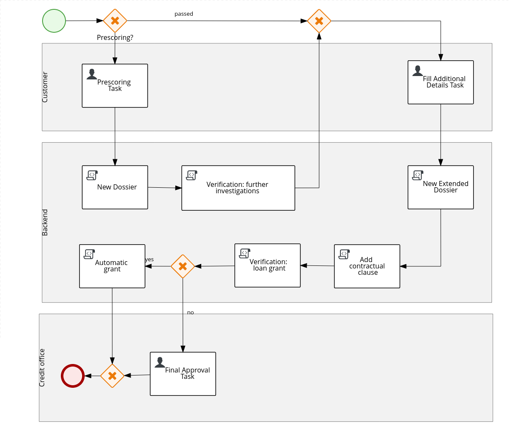

bank-loan example
=============================

Example of a bank-loan BPM service with spring boot.<br>
The project is composed by a kjar, representing a sample bank-loan BPMN process and by a kie-server running on spring boot.<br>

This is an image showing the BPMN process:



## Local Environment installation

### Prerequisites

You need an existing PAM business central listening at localhost:8080 (for monitoring the kie server).<br>
You need to define these two properties for the business central in order to monitor the kie-server:
```bash
<property name="org.kie.server.user" value="executionUser"/>
<property name="org.kie.server.pwd" value="executionUser"/>
```

### Install the kjar in your .m2 repo

```bash
  cd bank-loan-kjar
  mvn clean install
```

### Define the kie server properties

The list of kie containers (groupId, artifactId version) to deploy at startup must be defined inside the bank-loan-service.xml file.<br>
The kjars must exists inside your local .m2 maven repository.

Several application.properties are defined, each one with a specific database configuration:
 - h2 (default)
 - mysql

You can configure the user/password to connect with the controller (Business Central) through the following system properties inside the bank-loan-service.xml file:

```bash
 org.kie.server.controller.user=<user>
 org.kie.server.controller.pwd=<password>
```

### Custom Rest endpoint

A custom rest endpoint, registered under path /rest/pam is available and it adds additional APIs to the kie server.

### Run a kie-server and deploy a kjar

```bash
  cd bank-loan-service
  mvn clean && mvn spring-boot:run -Dorg.kie.server.startup.strategy=LocalContainersStartupStrategy -Dspring-boot.run.profiles=h2 -Ph2
```

### Run a kie-server and deploy a kjar with mysql dbms

```bash
  cd bank-loan-service
  mvn clean && mvn spring-boot:run -Dorg.kie.server.startup.strategy=LocalContainersStartupStrategy -Dspring-boot.run.profiles=mysql -Pmysql
```


### Swagger

Swagger is available at:
http://localhost:8090/rest/api-docs

load the json definition:
http://localhost:8090/rest/swagger.json

